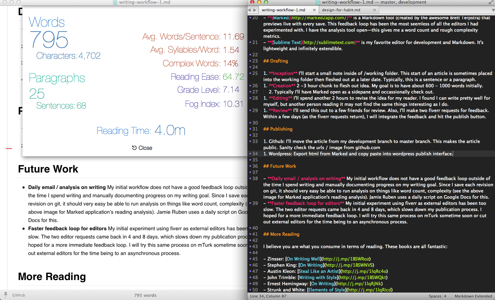
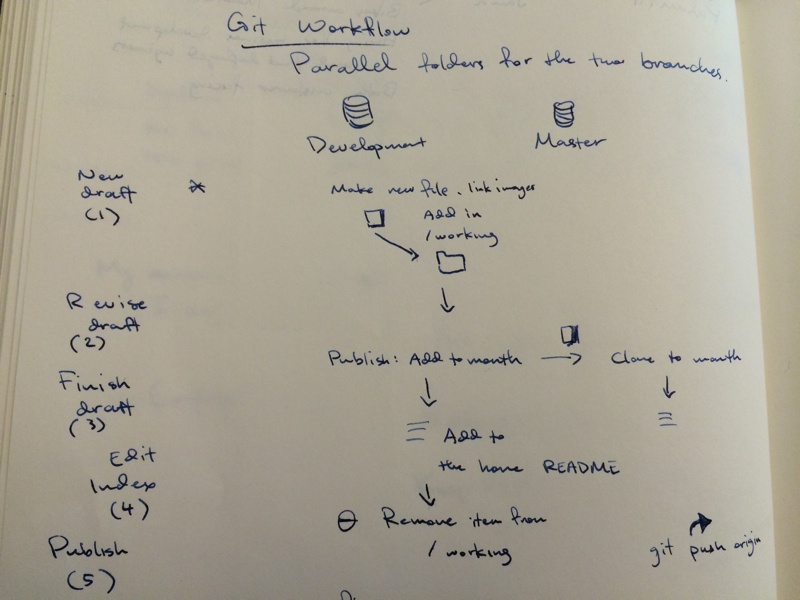

# Writing Workflow: Building a System that Lasts

This article is about the steps I've taken to iterate upon my writing workflow. I'm writing this partially as documentation of how to structure a writing project in the same way as a software project.

This [workflow](http://j.mp/1tJ7Gnq) is one under development. I have had problems with writing cadence and writing over the past few months. Writing this workflow is a means to  increase the quality and the frequency with which I publish.

[Jamie Todd Rubin](http://www.jamierubin.net) is an inspiration with detailed articles on his craft of writing. Jamie is a science fiction author and developer at RAND, who has written consistently about processes for writing and evernote for years [1]. The art of creating process is essential for producing great work in the long term. [Habits](http://j.mp/1tnMQNv) that reduce decisions into processes are critical to long term success.

In recent months, I have been writing consistently about 6-8 hours a week, most weeks. However, there have been weeks that I've written nothing.

Learning a new skill is hard and uncomfortable. This article is documentation on what's worked recently and follow-up experiments I'm going to conduct on learning how to write better and more consistently.

##Tools

   
*Screenshot of my writing environment with Marked / Sublime Text*

- **[Git](http://git-scm.com)** is typically used by developers to share and collaborate on code. It provides a nice interface between changes by individual developers and changes to be shared with a group. **Why do I use git for writing?** It gives me the ability to easily pare what articles are published and not yet published, I have nice versioning, and best of all, [github](https://github.com/fxchen/frankc) displays Markdown beautifully.
- **[Markdown](http://daringfireball.net/projects/markdown)** is a language for writing in plain text that converts to beautiful html. This lets me jot ideas down quickly without the formatting necessary in other formats. Markdown looks like a .txt file with 
- **[Marked](http://marked2app.com)** is a Markdown tool (by [Brett Terpstra](http://brettterpstra.com)) that previews live with every save. This feedback loop has been the most seemless of all the editors I had experimented with. I have the analysis tool open—this gives me a word count and rough complexity metrics.
- **[Sublime Text](http://sublimetext.com)** is my favorite editor for development and Markdown. It's lightweight and infinitely extendible.

## Drafting

1. **Inception** I'll start a small note inside of /working folder. This start of an article is sometimes placed into the working folder then fleshed out at a later date. Typically, this is a sentence or a paragraph.
1. **Creation** 2 -3 hour chunk to flesh out this original tiny idea. My goal is to have about 600 - 1000 words initially. Typically I'll have Marked open and be looking at readability statistics occassionally.
1. **Editing** I'll spend another 2 hours to revise the idea for my reader. The initial draft is typically framed for what I find interesting. I frame this writing session for what is interesting for another person.
1. **Review** I'll send this out to a few friends for review. Also, I'll make two fiverr requests for feedback. Fiverr is a service where small tasks (e.g. editing a blog post) can be done for five dollars. Within a few days (as the fiverr requests return), I will integrate the feedback from a fiverr editor.

   
*Initial sketch of my git workflow for publishing*

**Git Flow: (defn) a strict way to use git for project release**. I keep two branches of my git project (development / master) checked out simultaneously. The development branch is private whereas the master branch is public and accessible on github. The only common markdown file is the README.md which lists the [index of my site](https://github.com/fxchen/frankc). [2]

## Publishing

This is a two part process: 

1. On Github:
    2. Move the article from my /working folder (development branch) to a specific month (the master branch) for organization purposes. 
    2. Check the urls / images. Resize large images and adjust the formatting.
    2. Push to mainline. This makes the article public!
1. On Wordpress: 
    2. Export html from Marked and copy paste into Wordpress. This allows Wordpress to do the css styling and allow for an easy transition between Markdown and another blogging platform.
    3. Correct image urls to final remote locations
    4. Hit publish!

## Future Work

- **Automatic daily email / analysis** My initial workflow does not have a good feedback loop outside of the time I spend writing. Since I save each revision on git, it *should* very easy be able to run analysis on things like word count, complexity (see the above image for Marked application's reading analysis). Jamie Rubin [receives an email](http://j.mp/1r671xw) once a day that summarizes his writing for the day, streak length (currently 400+) and progress towards a goal. I plan to create something similar for my private development git branch.
- **Faster feedback loop for external editors** My initial experiment using fiverr as external editors has been too slow. The two editor requests came back in 4 and 8 days, which slows down my publication process. I hoped for a more immediate feedback loop as a forcing function to publish. I plan to try this same process on Amazon's Mechanical Turk sometime soon.

## More Reading

I have read each of these books recently and have enjoyed them immensely.

- Zinsser: [On Writing Well](http://j.mp/1BSWRoz)
- Stephen King: [On Writing](http://j.mp/1BSWNVS)
- Austin Kleon: [Steal Like an Artist](http://j.mp/1lqRc4o)
- John Trimble: [Writing with Style](http://j.mp/1BSWQkt)
- Ernest Hemingway: [On Writing](http://j.mp/1lqRjNk)
- Strunk and White: [Elements of Style](http://j.mp/1lqRicd)

-----

## References

[1] Many of Jamie's articles focus on the development of processes, such as automation or writing consistently. His transparency in the iteration of certain processes (such as his Google Docs scripts) are really insightful and can provide a nice model for anyone trying to learn and develop habits. Here are some awesome articles:
- [How I kept a 373 day productivity streak unbroken](http://99u.com/articles/30801/how-i-kept-a-373-day-productivity-streak-unbroken)
- [How I use Google Docs for Writing](http://www.jamierubin.net/2014/08/08/how-i-use-google-docs-for-writing)
- [Going paperless in Meetings](http://www.jamierubin.net/2014/05/20/going-paperless-whiteboards-webmeetings-evernote-and-skitch)

[2] Read the guides on gitflow by [Atlassian](https://www.atlassian.com/git/workflows#!workflow-gitflow) & [@Nvie](http://nvie.com/posts/a-successful-git-branching-model/) 

---- 

**More?** Subscribe to my "[Habits, Design, and Learning](https://tinyletter.com/frankc)" mailing list by clicking [here](https://tinyletter.com/frankc)!

