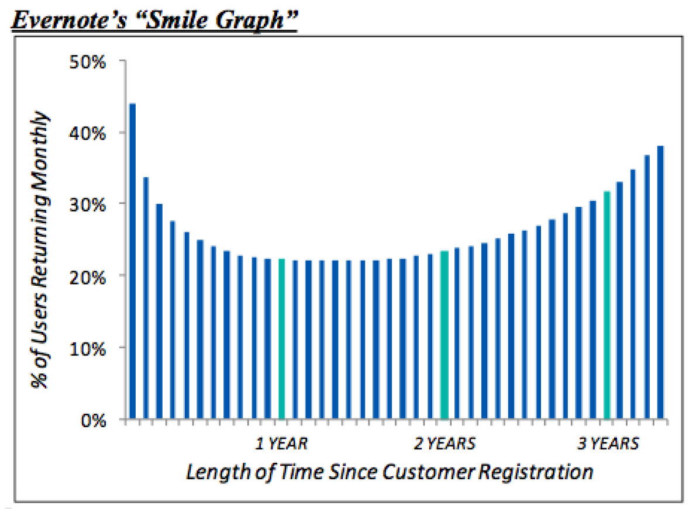

# How to Design for Habit: The Secret to Making Great Products

Let's say you created a product. A product that solves a common specific problem for many people. Yet, after a sign-up or an application download for your solution, people continue to have the same problem and *do not use your product*.

##"Why?!"

Why might someone continue to have a problem or use an inferior solution? These people *already* have routines based around their current solution. They may not even recognize they have a default routine. Help them use your product by developing new habits around **what they already do**. [1]

> Design is making the unintuitive intuitive.  
> *John Maeda*

Designing products that people use is a process. Ideally, this process starts as a small conscious change in their routine and incrementally grows until the product becomes the individual's go-to. At this point, the individual will have developed a new default *routine* for their use case.

Any new product trying to solve a person's existing problem is in a tough position. This person regularly encounters a problem, has noticed it, and does not go out of their way to solve it. This problem has been part of their routine. Part of your solution must make this new behavior intuitive. Your product *must* fit into what an individual does regularly.

  
*Penrose stairs are impossible stairs, they descend or ascend to form a continuous loop. This photograph (not Penrose stairs) is beautiful yet disorienting. People probably take these!*

This article is about how to best design software products into the routine of what users already do.

## What do people already do?

Designers should be thinking about how their solution fits into the workflow that **already exists**. Let's take Evernote, one of my favorite applications. Evernote is a suite of software and services for taking notes that act as "an external brain."

Bob is a student who has a problem with synchronizing notes across devices. He currently uses Microsoft Word for class notes. Microsoft Word works pretty well on his Mac, but doesn't work on his iPhone and doesn't have a way to synchronize online between his two computers. He wants to address some pain points:

- Bob wants to take notes.
- Bob wants to synchonize his notes online.
- Bob wants to be able to change devices and take notes.
- Bob wants to be able to take notes with consistent formatting.

**The principal of least surpise:** the person using the application should not be surprised by a software's behavior.

The note taking process in Evernote is straightforward (see the "Getting Started" guide [here](https://evernote.com/getting_started)). Bob might install Evernote on each device (PC, Mac, iPhones). Notes synchronize automatically between each of these devices (without the person needing to worry about copying or emailing the document). When Bob opens any note, the formatting stays consistent (Evernote looks the same and does not add additional "paper" formatting Word might).

The best software software should delight in only making small suprises— surprises that are subtle and seem *intuitive*. Intuition = non-intrusiveness. Design should give the right amount of information to guide the user through their interface.

A few years ago, Evernote released a usage graph they called the smile graph:

In this graph, during the first year of install, the number of users that use Evernote on a monthly basis drops off from over 40% to 20% . Then over the course of the next two years, the percentage of individuals that use this tool increases. Many software products have a graph that is strictly decreasing. Evernote's monthly user graph is different— over the course of the tool's lifetime, the number of people actually increases over time. Interpretation: people start to recognize how useful Evernote. Bob may start using the tool even though they did not use the tool at first.

Software designers should design their tools to be adopted by hooking into what the user already does.

## Fit into workflows

> We are what we repeatedly do  
> *Aristotle*

Starting to use a new application requires you to think about how to start a new habit. Experts say it generally takes 21 days to establish a new habit [2]. In the world today, the world of applications, tv, consistent and constant notifications, and a bleed between work and non-work situations, new software products live in a tenuous spot. These habits compete with the automatic and established habits we already have.

Similar to creating [new habits](http://j.mp/1tnMQNv) [3], there are effective patterns for software designers to create consistency:

- **Change environment** Software should change parts of the user's environment to help them use this new tool.
    - Software automatically start at system boot-up, so it is consistently at the taskbar.
    - Software can add extensions to applications that are already used, such as browsers plug-ins or integrations.
- **Notifications** Software can add notifications to mobile phones so users can have another interface to its functionality
- **Import** Software should import existing data. With any habit, there is always a bit of inertia to keep using the same pattern as before. Importing data from previous tools should help users bridge the gap between new and old by having all of the older data inside.
- **Trigger** Software can change the operating system hook. Upon install, a software can ask a user to change this default to open your product.

Exceptions to the rule:
- **Disruptive technologies** Software may create an entire new market and value network based around some value prior work did not have. [Wiki link](http://j.mp/1tnQwyO). Because no prior behavior or habits existed, this type of software establishes an entire new set of habits.
- **Inertia** Software may have a high inertia that makes movement very difficult. Services and platforms build ecosystems around use, and switching is hard. For example, I've heard many twenty-somethings whine about Facebook and their dislike of the privacy controls, yet many of these individuals still use the service. "It's what my friends use."

## Building Products as Habits

The most innovative and useful products of the future will be those that create lasting behaviors. Designers that understand how products fit into workflows can then better help their users find success in solving problems.

Now I want to ask you all a question:

- What tools do you use do you use everyday? What makes them indispensible?
- (Extra credit: Is it for the same reason you used it in the first place?)

-------

**References**

[1] BJ Fogg, my mentor and Stanford professor who started the Persuasive Technologies lab, describes a simple model for changing behaviors here [behaviormodel.org](http://j.mp/1zqTGCt). Relying on epiphanies is hard, instead, use these methods to help your users do what they want to do. 

[2] Dean, Jeremy, Making Habits, Breaking Habits: Why we do things, why we don't, and How to Make Any Change Stick. [Amazon link](http://j.mp/UIESiN)

[3] Design your Personal Operating System: habits. I discuss the basics of [habit design](http://j.mp/1tnMQNv) with lots of references to things I like to read.

**Images**  
- Spiral of Mind (Flickr) <http://j.mp/1gws4GG>
- Evernote Smile Graph (TechCrunch) <http://j.mp/1xuKiuG>

-----------

**More?** Subscribe to my "[Habits, Design, and Learning](https://tinyletter.com/frankc)" mailing list by clicking [here](https://tinyletter.com/frankc)!

