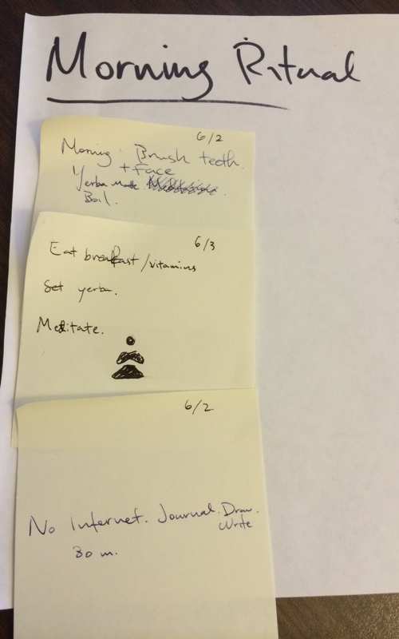

# Playlist your Morning Routine: Beat Complexity like a Boss

Some mornings start off awesome, and the day stays awesome. Other mornings start slow, and create a slowness throughout the day. **These slow days suck**

What's the difference between the two?

> At dawn, when you have trouble getting out of bed, tell yourself, "I have to go to work - as a human being. What do I have to complain of, if I'm going to do what I was born for - the things I was brought into the world to do? Or is this what I was created for? To huddle under the blankets and stay warm?"
> *Marcus Aurelius*

Your morning routine shapes the arc of the remainder of the morning and potentially the day. By defining a **crisp** morning routine, you can **maximize your day** in whatever it is you're trying to accomplish.

We are all works in progress. This article is about how you can shape your morning routine.

## Why Minimize Decisions in the Morning

To be productive...

- Everyday, Barack Obama hits the gym at the same time and alternates between cario or weights. He dresses in only blue or grey suits. [1]
- Before the Olympics, Michael Phelps would eat the same 12,000 calorie meals throughout a day. While training 6 hours a day, 6 days a week, he would even play the same music playlists prior to each session. [2]

These routines critically **minimize decisions**. Research has shown willpower and self-discipline is like a muscle, we can train them, but our willpower is a limited resource [3]. William James, the first American teacher of psychology, sought to form habits around routines to help us "free our minds to advance to really interesting fields of action."

I call a set of routines a **playlist**. In music, playlists allow you to move around items and has a certain progression. I have a specific run playlist that helps me start my run: it starts slow then speeds up. The first song on my run playlist istypically at 120 beats per minute, then gradually increases to 140-150 beats per minute then finally settles on a more consistent 180 beats per minute [4].

My morning routine has become a playlist. This progression that leads me towards a path minimizing decicisions and maximizing my ability to do things later in the day.

## The Playlist

  
*Writing out my morning ritual on post-its as a first step*

Tim Ferriss recommended Daily Rituals as part of his book club [4]. I loved this book because of the sheer breadth of how people started their day.

From the author [5]
> The book's title is Daily Rituals, but my focus in writing it was really people's routines. The word connotes ordinariness and even a lack of thought; to follow a routine is to be on autopilot. But one's daily routine is also a choice, or a whole series of choices. [...] a solid routine fosters a well-worn groove of one's mental energies and helps stave off the tyranny of moods.

Half way into the book, I decided to write down my morning routine. I realized I might iterate so I wrote it on post-its. This has been shuffled quite a bit and I find myself adding elements every now and then.

This playlist starts the moment I wake up in the morning.

1. **Alarm** I'll sit up and take a breath while my alarm is sounding, then swipe it off. I make sure I put the phone away so I am not distracted by email / texts.
2. **Make bed**
2. **Hygiene** I'll put on face wash then start brushing my teeth.
3. **Water** I will place yerba matte into my French press and start my water pot to boil.
4. **Shower** While still brushing, I'll jump into the shower.
5. **Suit up** After showering, I'll take my weight, and dress for the day.
6. **Breakfast** I'll eat three raw eggs, drink down one liter of cold water with my daily vitamins. (Water will be done boiling by now) I'll set the tea.
7. **Meditate** I'll meditate for ten minutes.
8. **Create** (without turning on my computer) I'll draw or write or some combination of these two on paper.

## Test and iteration

The critical piece of any real system is the test and iteration on individual pieces. Everyday, there can be different needs and to start a solid routine, testing and adapting it is critical. Failures are important learning opportunities, and here are some of mine.

Furthermore, writing down my routine on post-its were only part of the story… Many of these steps already existed as things I did, writing it down was simply a way to think through the problem. They helped me better sequence the order and transitions between different activities. Finally, I no longer need to look at this set of post-its, it's become nearly automatic.

Here are some iterations that were less optimal:

- **Check email / Social media** These two types of applications are incredible time sinks when I need to get moving in the morning. In each of the steps above, I minimize my time on my phone.
- **Meditation sequencing** When I first started meditation, I tried to do this as soon as I got out of bed, but found myself too groggy to really focus on my breath for ten minutes. Similarly, I tried meditating before breakfast and found my stomach growled way too much. when I did not boil water early, my water pot would typically start screaming mid-way into my meditation.
- **Falling off the wagon for meditation** In the past, I would consistently meditate for months, then fall off the wagon for a few months, then return.  Thus far, this playlist has kept me on the wagon.
- **Fractured toes** The past two weeks I fractured two toes. Before I sit down for writing, I have to clean and re-bandage my foot.
- **Pager duty** Every couple of months, I go on pager duty for work. This results in a rough two week period where I really have to focus on individual playlist steps because my sleep may be punctuated by a mid-night page. Pagers? [7]

## Routines as playlists

Playlists represent individual actions to be performed. My morning routine has been a work in progress for years, and I expect this to continue to evolve.

**What you should take away?** Playlists are a way to think about behavior routines and a tool to increase productivity. After I wrote my initial list, I found different combinations worked better than others. Listing out my "morning playlist" helped me optimize my output for the rest of the day.

Send me an email @ <frxchen@gmail.com> if this works for you!

----

**References**

[1] Vanity Fair: [Obama's Way](http://j.mp/ZGDZCo "Obama's Way")

[2] Motley Health:  [Michael Phelps Workout and Diet](http://j.mp/1ocnpHt "Motley Health: Michael Phelps Workout and Diet")

[3] HBR: [Boring is productive](http://j.mp/1qBCyXo "Boring is Productive"). This is a great summary piece on some of Roy Baumeister's work. The same mental energy you use to choose items of clothing or food is used for your higher importance tasks.

[4] Research shows elite marathoners (regardless of height / stride / running form) settle on 180 steps per minute. Because people subconsciously attune to their environment (esp music), playlists set to this cadence likely attune running cadence to this speed, thus improving performance.

[5] Tim Ferriss blog: 1) [Daily Rituals](http://j.mp/1vOFQ9o "Daily Rituals") 2) [The Odd (And Effective) Routines of Famous Minds like Beethoven, Maya Angelou, and Francis Bacon](http://j.mp/1qBINup "The Odd (And Effective) Routines of Famous Minds like Beethoven, Maya Angelou, and Francis Bacon")

[6] Daily Rituals: How Artists Work ([link](http://www.amazon.com/Daily-Rituals-How-Artists-Work/dp/0307273601)). I highly recommend this book. The ones I enjoyed the most: Benjamin Franklin, Frederick Chopin, Ernest Hemingway, Haruki Murakami.

[7] For those not in software development: customers facing issues and system monitoring tools will page engineers. Our team has two engineers who rotate on primary and secondary pager  on-call when one of these pages occur. If the primary engineers does not respond within a set amount of time, then the secondary gets paged. If the secondary does not respond, then his / her manager will get paged.

**BONUS** Routines from blogs I love to read

- [Leo Babuata](http://j.mp/1mYaWFX)
- [Maneesh Sethi](http://j.mp/TXcPw1)
- [Ryan Holiday](http://j.mp/1m6I4jm)
- [Tim Ferriss](http://j.mp/1r19Y15)
- From BufferApp: [Daily Routines of Famous Entrepreneurs] (http://j.mp/1oqdhMu) [Improving Your Morning Routine](http://j.mp/1qBJXWA)

