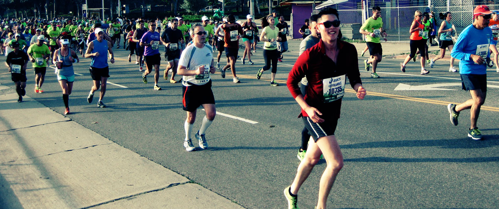

#About @Frankc

  
*Taken on a run around Los Angeles. 2013*

##Hello world
This piece of internet real estate is reserved thoughts that generate ideas, conversations, and projects. I'll be writing to find and explore my interests with a community of people.

I build stuff as part of my everyday life. I jot some of what I build in workflows, scripts, research notebooks, evernote, simplenote, sketch notebooks, note cards. Some of these things become permanent parts of what I do, some of it gets shared among friends, and most of it never gets shown to the world.

Because it's much easier to start a project than to finish a project, I am writing consistently and forcing myself to hit the publish button. The best growth happens in spurts. So here we go. The inaugural post to my blog.

##Who am I?

Part of my life was spent as a researcher. I worked in human-computer interaction and built technologies to help motivated individuals create habits by shaping their environment and their habits.

Currently, I spend most of my time developing software. I work with a highly talented team to change how people use enterprise software at AWS.

##Stories

Sharing narratives is a part of the human experience. When you hear a narrative, you use your perspective to create a new and different understanding of the story than the one I tell. Your mind turns complex topics into simple narratives.

##Etc…

I have a photo of me running at the top of this post. Running has brought me to see, hear and feel the world differently. I love swimming in every body of water I can find, eating as much spicy ethnic cuisine as my stomach can handle, and traveling by overnight train whenever I have the chance.

-----------

**More?** Subscribe to my "[Habits, Design, and Learning](https://tinyletter.com/frankc)" mailing list by clicking [here](https://tinyletter.com/frankc)!

