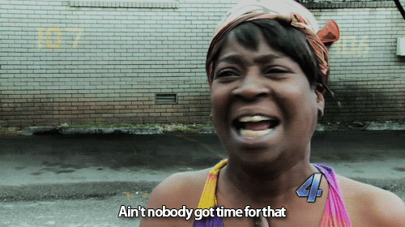
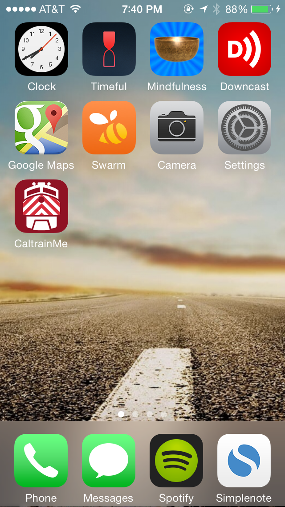
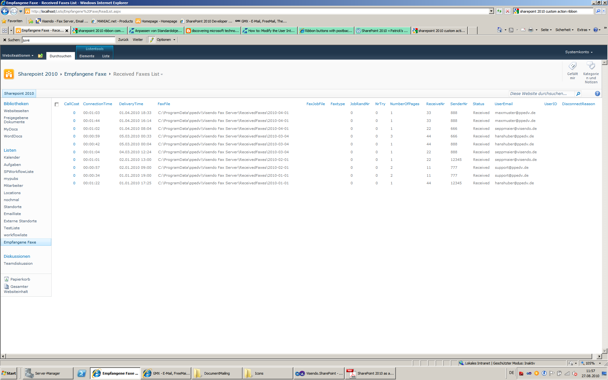
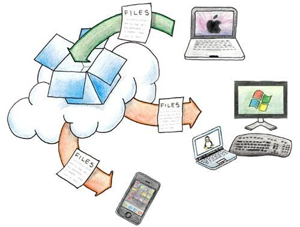

# "Why Your App Got Deleted…" Behavioral Antipatterns for Product Design

Notice how many the apps on your phone don't get used.

80% of the apps on your phone get used less than once per week

This is why I absolutely **love it** when I can delete phone apps. Minimizing the amount of apps I have on the iOS home screen is like [minimizing decisions](http://frankc.wordpress.com/2014/08/03/playlist-your-morning-routine-beat-complexity-like-a-boss/) in the morning. The less I see (even a minuscule extra icon or notification) the faster my attention can go back to using my phone.

When I go on an app deleting spree, it comes in one of two forms:

1) Every time I have an ios update and don't have enough space on my phone

2) I have some pressing need for a product and am deciding which one is best. This happens about once every few months. I'll realize I have wanted to fulfill some need and install many similar apps to find the very best one. Recently, I downloaded 10 different calendar and todo list apps. I enabled notifications for all of them. Each app was on the secondary screen of my phone. In one week, I went back and deleted all the apps that don't work for my use case. I test apps similarly to how I [learning courses](frankc.wordpress.com/2014/10/26/the-ultimate-beginners-guide-to-web-development-lessons-from-the-web-lead-of-an-amazon-web-service/): I'll take many potential solutions and test each until I find the one that works for me.

  
*The app that survived the great calendar purge was [timeful](http://timeful.com), which I highly recommend. More on the current home screen [[1](#application-churn-notes)].*

## Patterns for Application Churn

Many people in the corporate world have used a product called Microsoft Sharepoint. For those who haven't used it, it's Microsoft's web-based tool to share and receive documents, securely. In each workplace where we used it, Sharepoint was more of a hindrance to receive files than a welcome solution.

 
*Sharepoint presented Windows Explorer in the browser. This screenshot has a fax import for Sharepoint. Image credit [Visendo](http://www.blog.visendo.com/post/2010/08/27/Visendo-Fax-Server-and-SharePoint-2010-How-to-ScreenShots.aspx)*

**Why was sharing files painful?**

- The **product was one-off**. The product does not exist in within an ecosystem of other use. I use Sharepoint for one reason, to receive files. Yet, I already receive files through email just fine. IT required the sharing of massively distributed files through Sharepoint
- The **product aligned with a business need that didn't fit with “actual” work**. Sharepoint had nothing to do with the thing I was working on, instead it was simply a way to receive a file from the file creator
- The **product didn't offer offer easy access points**. Emails occassionally had a link to the team's Sharepoint (IT departments frown upon attaching files due to access control). Accessing Sharepoint usually required another login to the company's sharepoint site. Furthermore, if I was working remotely and off VPN, this required yet another login through the VPN software.  Simply opening to a document may require up to two extra logins and the cognitive tax of doing so

Companies today have options to share and reeive files: Box, Dropbox, Amazon Zocalo, Google Drive, Apple's iCloud Sync. I'm checking out Sharepoint 2013 as part of Office 365 ([ref](https://products.office.com/en-us/sharepoint/sharepoint-2013-overview-collaboration-software-features)), it appears to be better integrated with the file system itself, much like the competitive offerings.

 

Dropbox is a popular consumer solution to sync files between computers. The interface fits what I already see throughout my computer. It looks just like a folder. Only it syncs between each of my computers. I can put the Dropbox folder anywhere on my computer, and I can put whatever I want in it. This application presents a simple interface to the complex problem of sharing my own files between all of my computers. They helped people do what they were [already doing as part of their workflow](http://frankc.wordpress.com/2014/08/09/how-to-design-for-habit-the-secret-to-making-great-products/)

## The Damn Easy Principle

Recently I started to listen to podcasts regularly. And it was because listening and using podcasts became really easy after I moved away from Apple's default Podcast app.

**Opening Apple's Podcasts wasn't the issue, it was consistently using it.** 

I had no trouble opening the Podcast app. I had no trouble subscribing a few podcasts. However, this Podcast app showed far too much complexity every time I tried to use it. Listening and using the product was the bottle neck. Podcasts did not automatically download and every time I wanted to listen to podcasts, I had to select the individual to listen to. Until recently, I never listened to more than podcast episode per month. Here's what I saw every time I wanted to listen to podcasts:

- Open Podcast. See new episodes need to be downloaded
- Open iTunes (or plug in my device to my computer)
- Wait for my computer to download episodes
- Press sync on my iTunes after the episodes have finished downloading
- (Bonus pain: Make sure I am syncing podcasts with the correct computer. Only one of my computers can sync Podcasts with my phone)
- Play new episode

A friend recommended Downcast. Within my first day of using Downcast, I knew I would be using it for a long time. It aggregates podcasts I want to listen to in to a playlist of unplayed episodes, synchronizes between devices, and downloads new episodes automatically.

Here are the exact same steps to play new episodes of podcasts in Downcast:

1. Open Downcast. The application automatically starts downloading new episodes
2. Play new episode. Listening became **Damn Easy**

## Summary

Many apps get deleted. How can you make sure yours doesn't get deleted?

- Make the product integrated into the workflow of the task the user wants to perform
- Make the access points straight forward and similar to what the your user already goes through
- Make the product use / consumption process an absolute ease. Creators of content may be fine going through tedious tasks, but consumers of the same task may not be fine going through the same tedium 

**Notes**

[1] 

- Apps on the Homescreen
    1. **Clock** 
    2. **Timeful** for managing my daily reminders and calendar items
    3. **Mindfulness Bell** I use this to time meditation or pace work sessions
    4. **Downcast** (described above)
    5. **Google Maps** 
    6. **Swarm** for checking in on Foursquare
    7. **Camera** 
    8. **Settings** 
    9. **Caltrain** Official Caltrain app, the largest value add? Rider advisories
- Apps on the Dock
    1. **Phone** 
    2. **Messages**
    3. **Spotify** for listening to music
    4. **Simplenote** Simplenote is part of my information processing workflow. It's an incredible tool by Automattic that lets you have have synchronous editing between devices

**Found this useful?** I send exclusive emails with secrets on habits, learning and design to my [mailing list](https://tinyletter.com/frankc)

