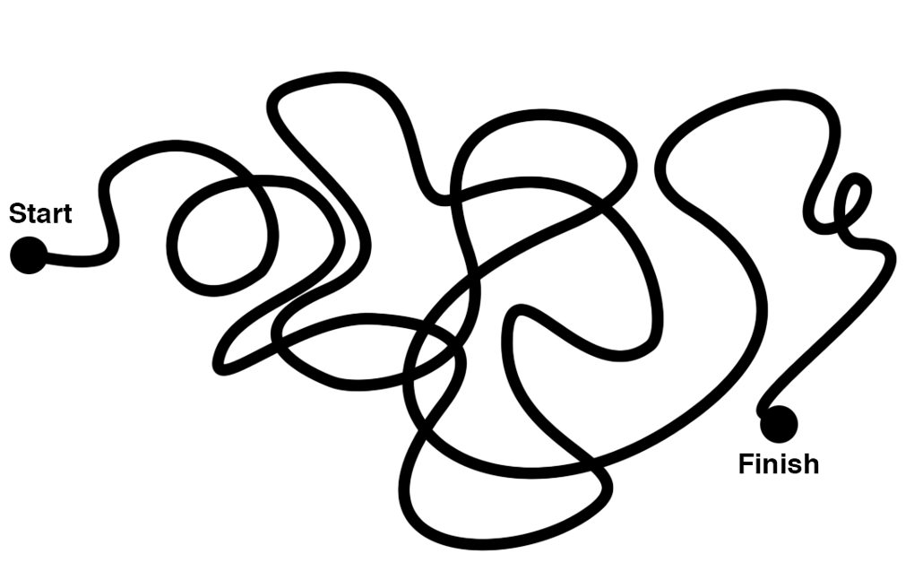

# The Ultimate Beginners Guide To Web Development — Lessons from the Web Lead of an Amazon Web Service

My friends love learning. This essay is an amalgamation of emails I have sent friends and things I have picked up in my journey to learn web development [[1](#notes)]. By the end of this guide you'll be able to answer the following questions: 

- "How might I build a personal website in an afternoon?"
- "How might I start web development as a career?"
- "How might I become a future expert in web development?"  

Here's a summary of what you'll learn by section:

1. **[How to understand the basics](#basics)** of a webpage and the internet
2. **[How to structure learning](#structure)** on web development fundamentals
3. **[How to engage and grow](#experts)** your expertise

These lessons are pulled from how I have learned. At the end of this guide, you'll have the resources necessary to grow in your desired web development expertise (even if it is just for an afternoon).

> Everything in life either grows or dies
> *Anthony Robbins*

Web development is centered around communities of developers sharing and collaborating together to build software. You'll see links to [Github](https://github.com/about), the world's leading open community to share code with "friends, colleagues, classmates, and complete strangers."

*Graph of github.com repositories. Image credit [RedMonk](http://j.mp/Z7SoyA)*

In the remainder of this guide, you'll learn how you can grow from a beginniner to an expert in web development. This is by no means a comprehensive list of resources. Constraints are powerful in forcing maximum results with minimal investment. This guide lists resources useful for results. This guides teaches an approach on learning and exploring that **you**, **web developer**, will be able to use for what you're trying to do.

I want to emphasize action:

- If you have an interest in web development, you should **block two hours** for [The Basics](#basics) section and return to reading this guide at that time. For beginners, it's important to have the right expectations. At the end of these hours, you should have a basic understanding of web development and a web presence.
- Else, if you're looking to learn web development as a hobby or as a career, you may want to print this document ([pdf](https://github.com/fxchen/frankc/raw/master/2014%20October/learning-frontend-software.pdf)) and bookmark it for easy reference. The most important part of **learning a craft** is building a consistent habit, for more on structuring [habits](http://frankc.wordpress.com/2014/08/03/design-your-personal-operating-system-habits/), see [[2](#notes)]. At the end of this reading, you will have a baseline for qualified resources on how to start. This prevents the choice analysis paralysis (when too many choices makes the choice difficult).

The following sections are ordered by increasing difficulty.

## The Basics

I have sent various emails to friends who want to learn web development. HOWEVER, my results over the past 10 years show about 75% who want to learn web development actually want to do something quite different. They want to build a web presense and register a domain name. To complete this section, you'll need a web browser and at least two hours to set up a web presense and do some reading.

If this is your goal, you should use a site generator that lets you share your site without touching any code. Use **one** of the following site generators to get started: 

- [about.me](http://about.me/)
- [Wordpress](http://wordpress.org/)
- [Weebly](http://www.weebly.com/)
- [Wix](http://www.wix.com/)
- [Webs](http://www.webs.com/)

*Note: You might ask yourself why more than one generator is [listed](#limit). Each has a different strength and are very straight forward to test. These are listed by my ease of use, e.g. I found about.me to be extremely easy to use, but you may find Weebly fits your needs better*

But wait, how does the internet work? [Introduction on how the browser and internet](https://docs.google.com/presentation/d/1ruLiICsmBwZ3KFBkmOjQcQZAPS85BWImQu71MMcDs6w/edit#slide=id.i0) (by Google researchers).

Excerpt:   
> The internet is a global network of computers. It is millions of computers around the world, all connected. People often think of the internet as a cloud in space. In reality, every computer in the "inter-network", or internet, is connected by actual wires -- ethernet cables, phone lines, and fiber optic wiring on the ocean floor!

**Detailed links**

- What makes Chrome or Firefox or Internet Explorer work? What is HTML and CSS? 
    - Follow tutorials on [HTML Dog](http://www.htmldog.com/)
    - Search Quora. Quora is a resource to find guides to start. E.g. [On CSS](https://www.quora.com/What-are-some-best-practices-for-CSS); [On Learning HTML / CSS / AJAX](https://www.quora.com/What-is-the-best-way-to-educate-yourself-on-HTML-CSS-JavaScript-and-AJAX)
    - Search [StackOverflow](http://stackoverflow.com). StackOverflow is the go to resource for many developers. As you start to search for detailed questions, you'll find a StackOverflow page with the answer. These are often more technical in nature than Quora
- Want a more in-depth look on the internet? [A white paper from Stanford](http://web.stanford.edu/class/msande91si/www-spr04/readings/week1/InternetWhitepaper.htm)

## Diving Deeper 

The resources in this section are meant for those who want to start learning the fundamentals of web development and dive deeper than the basics. This is perhaps the **most important part** of this article. These resources are part of a long term learning process that starts with learning how to structure your learning. At the completion of this section, you should have a basic knowledge of how to deconstruct and play with most web sites you use. Furthermore, you will have a set of resources to continually learn web development.

#### Set up your development environment

Learning a new environment is hard. This is a walk through of my basic environment set up. Whenever I have a new machine. I download [SublimeText](http://sublimetext.com), [Google Chrome](http://chrome.com), [iTerm2](http://iterm2.com)

- **Chrome Extensions**: Each of these extensions enhance the Chrome user experience
    - [PageSpeed](https://chrome.google.com/webstore/detail/pagespeed-insights-by-goo/gplegfbjlmmehdoakndmohflojccocli?hl=en). This is an extension to allow you to use Google's pagespeed insights to make your website faster [Google Developer's Guide](https://developers.google.com/speed/pagespeed/)
    - [AngularJS Batarang](https://chrome.google.com/webstore/detail/angularjs-batarang/ighdmehidhipcmcojjgiloacoafjmpfk?hl=en). This is an extension to debug AngularJS applications. AngularJS is a Javascript framework I describe later in this guide
    - [EditThisCookie](http://www.editthiscookie.com). Cookies are a way to keep information about a website you're using. This is the technology that lets you open gmail without logging in each time
- **Plugins for Sublime**: Each of these plugins enhance the Sublime user experience
    - [Package Control](https://sublime.wbond.net/installation)
    - [jshint](http://www.jshint.com/install/)
    - [sublimelinter](http://www.sublimelinter.com/en/latest/)
    - [sidebarenhancements](https://github.com/titoBouzout/SideBarEnhancements)
    - [brackethighlighter](https://github.com/facelessuser/BracketHighlighter)
    - [theme-soda](https://github.com/buymeasoda/soda-theme/)
    - [Angularjs](https://github.com/angular-ui/AngularJS-sublime-package) 
    - [GitGutter](https://www.google.com/search?q=git%20gutter%20sublime%20text)
    - [DocBlockr](https://github.com/spadgos/sublime-jsdocs)
    - [Markdown-editor](https://github.com/SublimeText-Markdown/MarkdownEditing/)
    - [Gist](https://github.com/condemil/Gist)
- **More?**
    - Sublime Text Customization Guides: [From Scotch.io](http://www.hongkiat.com/blog/sublime-text-plugins/); [From Hongkiat](http://www.hongkiat.com/blog/sublime-text-plugins/)
    - Web Development Environment Set-up Guides: [From @nicolashery](https://github.com/nicolashery/mac-dev-setup); [From damln](http://www.damln.com/log/setup/) 

Note: I don't dive deep on all the tools mentioned as they are beyond the scope of this guide (and others do a much better job of it).

#### Learn your web console

The console allows you to interact with HTML and Javascript interactively. This will let you change what you see and see what is happening behind the scenes as you go through a web page.

- [On ng-book](https://www.ng-book.com/p/Debugging-AngularJS/)
- [By Team Tree House](http://blog.teamtreehouse.com/mastering-developer-tools-console )
- [By Google Devtools](https://developer.chrome.com/devtools)

Read these guides for a basic understanding of the console. You'll return to the console often as you continue to develop. If you master the basics of inspecting HTML and debugging Javascript, you'll reap progressively larger benefits as you continue to learn. Especially as you develop more complex applications, you will have huge dividends in time savings if you master the console.

*Knowing how to use the debugger is like having Quicksilver's superpower from X-Men. You can stop Javascript execution, change variables, manipulate HTML, and much more. Image credit [EW](http://www.inentertainment.co.uk/)* 

#### Structure your learning

A critical juncture in learning is a habit to jump start your learning process. For example, I like to learn in the mornings. I describe my morning routine [here](http://frankc.wordpress.com/2014/08/03/playlist-your-morning-routine-beat-complexity-like-a-boss/). When I am learning a new craft, I will block at least 30 minutes every morning to learn and practice this craft prior to leaving for work. For more on building a habit see: [[2]](#notes)

Courses:

- Udacity: [HTML & CSS](https://www.udacity.com/course/ud304); [Javascript](https://www.udacity.com/course/ud804); [Web Development](http://www.udacity.com/overview/Course/cs253) 
- Codeacademy: [Basics HTML & CSS](http://www.codecademy.com/en/tracks/web); [JQuery](http://www.codecademy.com/tracks/jquery); [Interactive Website](http://www.codecademy.com/skills/make-an-interactive-website)
- NetTutorials: [Web Development](http://code.tutsplus.com/categories/web-development)
- CodeCombat: [Learn to Code By Playing a Game](http://codecombat.com/)
- Coursera: [Human-Computer Interaction](https://www.coursera.org/course/hciucsd); [Web Applications](https://www.coursera.org/course/webapplications) Note: these two are limited to when they are offered on Coursera

For structured courses or books: **limit what doesn't work**. Use this list as a list to sample from, and sample the course or book to learn what learning style works for you. For a book, you only need to read 30-40 pages to decide if a programming book's author's style works for you. Even if someone else recommended a book, it may not be ideal for you, everyone's learning style and background is different. The same thing applies for courses. Programming books and courses vary in quality of learning depending on your learning style and skillset. For example, [Mastering AngularJS](https://www.packtpub.com/web-development/mastering-web-application-development-angularjs) is great if you have experience in Javascript and AngularJS. This book jumps from high level concepts for beginners to specific solutions to detailed pain points geared for experts. This type of jump may be disorienting if you're new to AngularJS.

| Don't do this | Do this |
|------|-------|
|||

*When It comes to your learning, use this technique of sampling then eliminating what doesn't work. Image Credit [Julie Zhou](https://twitter.com/joulee), originally used in a fantastic article on [Junior versus Senior Designers](https://medium.com/the-year-of-the-looking-glass/junior-designers-vs-senior-designers-fbe483d3b51e)*

## Future Experts

This section is related to a base set of resources are critical to specializing in Javascript and AngularJS. 

####  Step 1: On Javascript and Web Technologies

Read these resources as you're developing your project (or are going through the courses listed in the Structured Learning Section).

- [Crockford: JavaScript The Good Parts](http://j.mp/1C1H18k)
- [Javascript Garden](https://bonsaiden.github.io/JavaScript-Garden/)
- [Essential Javascript Design Patterns](http://addyosmani.com/resources/essentialjsdesignpatterns/book/)
- [Google Developer's Guide for Angular](https://developer.chrome.com/apps/angular_framework)
- [Learning JQuery](http://www.learningjquery.com/) & [Bootstrap](http://getbootstrap.com)
- [Reintroduction to Javascript from Mozilla](https://developer.mozilla.org/en-US/docs/Web/JavaScript/A_re-introduction_to_JavaScript)
- [Secrets of the Javascript Ninja](http://www.amazon.com/Secrets-JavaScript-Ninja-John-Resig/dp/193398869X)

#### Step 2: On Angular JS
There are many flavors of Javascript frameworks [[3](#notes)]. The one I am most familiar with is AngularJS. As of this writing, AngularJS has one of most active communities on Github and [many developers swear by it](https://www.google.com/search?q=why+angularjs&oq=why+angularjs). For a showcase of applications built on AngularJS: <https://builtwith.angularjs.org/>. This framework introduces language constructs that engineers familiar with iOS and Android development use that are traditionally missing in Javascript. AngularJS is the right framework for many teams that want to rapidly iterate and maintain a single page application.

**Must reads**

- [Official Documentation](http://docs.angularjs.org/)
- [O'Reilly AngularJS book](http://www.amazon.com/AngularJS-Brad-Green/dp/1449344852/ref=sr_1_1?ie=UTF8&qid=1372874049&sr=8-1&keywords=angularjs)
- [Mastering AngularJS](https://www.packtpub.com/web-development/mastering-web-application-development-angularjs) - for intermediate developers

**Diving deeper**

- A **very** comprehensive [list of resources on AngularJS](https://github.com/jmcunningham/AngularJS-Learning). This collection is constantly updated
- Tutorials + videos: [Organized tutorial](https://thinkster.io/angulartutorial/a-better-way-to-learn-angularjs/) via Thinkster.io (uses Egghead.io tutorials) + [part 2](https://thinkster.io/angulartutorial/mean-stack-tutorial/) with full stack components. Individual video tutorials: <https://egghead.io/>
- [Angular Recipes](https://fdietz.github.io/recipes-with-angular-js/)

#### Step 3: On becoming a Browser Whisperer

**Reads**

- On Testing: [Beautiful Testing](http://www.amazon.com/Beautiful-Testing-Professionals-Software-Practice/dp/0596159811); [Application testing via yearofmoo](http://www.yearofmoo.com/2013/01/full-spectrum-testing-with-angularjs-and-karma.html) 
- Mozilla Developer's [Guide to Javascript](https://developer.mozilla.org/en/JavaScript/Guide)
- [ACM: Best Practices on the Move: Building Web Apps for Mobile Devices](http://queue.acm.org/detail.cfm?id=2507894) while this essay is a collection of recommendations for making websites better for mobile devices, it serves as a nice template for modern performant web applications
- [ACM: How Fast is Your Website](http://queue.acm.org/detail.cfm?id=2446236) this essay gives a nice overview for how to understand performance within web applications
- Cross-Origin Resource Sharing: This [wikipedia article](https://en.wikipedia.org/wiki/Same-origin_policy) has a great set of links related to how to understand why this is important and methods to perform Cross Origin Resource Sharing for your website.
- [Fundamentals of Algorithms by GeeksForGeeks](http://www.geeksforgeeks.org/fundamentals-of-algorithms/) has my favorite collection of algorithms on the web. It has details on run time for you to remember computer science fundamentals (and a great primer if you are interviewing)

**Specific to AngularJS**

- [Angular UI](http://angular-ui.github.io/): set of useful tools built for Angular. For example, this project has a subproject for integration of Twitter's [Bootstrap components](http://angular-ui.github.io/bootstrap/)
- [Understand data binding](https://stackoverflow.com/questions/9682092/databinding-in-angularjs/9693933#9693933) via StackOverflow by one of the creators of Angular
- Improving performance with data bound components with [BindOnce](https://github.com/Pasvaz/bindonce)
- Approaches on Combining Facebook React with AngularJS [[1](https://www.quora.com/Pete-Hunt/Posts/Facebooks-React-vs-AngularJS-A-Closer-Look)] ; [[2](http://davidandsuzi.com/ngreact-react-components-in-angular/)]
- Another approach to [improving performance for ngRepeats](http://www.williambrownstreet.net/blog/2013/07/angularjs-my-solution-to-the-ng-repeat-performance-problem/)

**What is the hardest part of developing for the web? What are pitfalls that every web developer should know?**

The hardest part of developing on the web is constant change. To succeed in delivering a great customer experience, you sometimes feel like you're hitting a flying target with a bow and arrow while on horseback. Browsers / browser versions / frameworks change all the time. For example, something that worked last week may not work this week due to a dependency change in your framework that seemingly has nothing to do with a tool you're using within your project, and this problem only pops up in IE 10.

The easiest pitfall of development is not testing. At the highest levels, testing can be a critical piece to ensure customer success. Entire books are dedicated to the topic of testing and beyond the scope of this beginners guide. Testing may be often overlooked in young development teams. Browser tests are particularly hard because browsers are interpretations of how the web protocols should work. There is no guarantee of consistency between browsers and browser versions.

**How can I practice development everyday or reinforce my learning?**

*Learn widely*. Web development is a moving target with many different areas to specialize in. Here are some ways to stay engaged with different communities

- Newsletters: [Official Mailing List](https://groups.google.com/forum/#!forum/angular), [AngularJS Daily](http://www.angularjsdaily.com/), [ng-newsletter](http://www.ng-newsletter.com/)
- Engineering Blogs: [Google](http://googledevelopers.blogspot.com/), [AWS](http://feeds.feedburner.com/AmazonWebServicesBlog), [LinkedIn](https://engineering.linkedin.com/blog), [Twitter](https://blog.twitter.com/), [Facebook](https://code.facebook.com/posts/), [Github](https://github.com/blog), [High Scalability Blog](http://highscalability.com), [AirBNB](http://nerds.airbnb.com/)

*Find a mentor*. Chances are you know someone who does this professionally or unprofessionally. Ask them for code reviews or problems you're having. Talking aloud is an incredibly powerful way to solve problems. Thinking as an engineer means moving between different levels of abstraction. Someone who has 20 years of experience sees an entirely different set of problems when I ask this person a question than I do when someone asks me the same question.

*Build something and stretch your skills*. You can choose the tools in what you build every day in your practice. Github has a variety of codebaes for you to play with that are a "[checkout](http://git-scm.com/book/en/Getting-Started-Git-Basics)" away. Even if you never end up releasing or integrating someone else's project into your development projects, you have the opportunity to play with something cool.

  

**I'm smiling because I hope you'll send me feedback!** Send me an email at <hi@frankc.net> on what worked or didn't work for you!

Special thanks to [Abhishek Mantha](http://abhishekmantha.com/) for critical insights on how he learned development, [Jeffrey Song](http://www.linkedin.com/pub/jeffrey-song/4/651/760) for a beginner's narrative on using this guide for learning web development, and [Amaan Penang](http://amaanp.com), [Nate Ngerebara](http://www.linkedin.com/in/ngerebara) for feedback on early drafts of this guide.

----

**Notes**

[1] **Why am I writing this?** I have learned a lot in the past few years and wanted to share a set of resources with my friends who wanted to learn web development and internet friends.

I started web development at 12—at that time, people "surfed the world wide web." For most of my academic and professional career, I was a researcher where I created software as part of my research. I built systems to study [social influence on opinion](http://www.rand.org/pubs/tools/expertlens.html) at RAND, [mobile environmental impact](http://cens.ucla.edu/) at UCLA, and [behavioral theories on mobile phones](http://med.stanford.edu/news/all-news/2011/08/eat-a-carrot-and-get-out-of-that-chair-or-your-ibird-dies.html) at Stanford). 

Development at a company or startup requires a different set of skills. I studied Computer Science and researched in Human-Computer Interaction, both of which required development. Yet, the craft of development is very different from academia. The focus of development is much more team oriented. From early 2013, I led the web team on [Amazon Zocalo](http://aws.amazon.com/zocalo). Zocalo is a secure enterprise sharing and collaboration service that uses AngularJS as its Javascript frontend framework.

[2] **On developing habits for learning** I have found these to be good systems to model for learning new skills:

- Tim Ferriss's [4 Hour Chef](http://www.amazon.com/The-4-Hour-Chef-Learning-Anything/dp/0547884591) - this is a book on learning, that also teaches cooking
- [BJ Fogg's Tiny Habits](http://tinyhabits.com) - this is a habit program on learning how to develop simple habits 
- [Lift](http://lift.com)  - this is a social network for habits

[3] **On picking the right Javascript framework** I focus on AngularJS in this guide. To prevent frontend framework choice paralysis, AngularJS is the only Javascript framework presented. AngularJS has been hugely popular and useful for many developers who use it. If you're interested in what else is out there, I would suggest **[TodoMVC](http://todomvc.com)** TodoMVC implements the same To-do application using many popular Javascript frontend frameworks. This allows for a comparison and bootstraps the ability for people to prototype in different flavors of frontend frameworks.

---- 

**More?** Subscribe to my "[Habits, Design, and Learning](https://tinyletter.com/frankc)" mailing list by clicking [here](https://tinyletter.com/frankc)!

